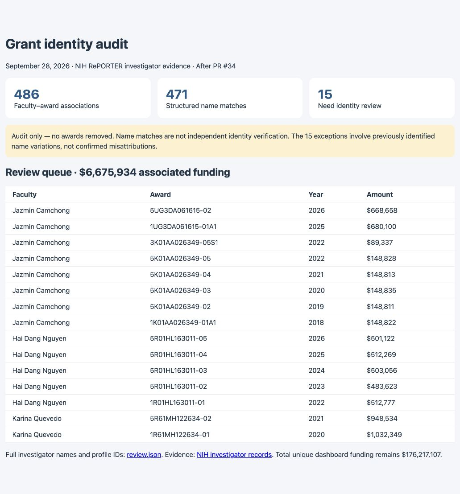

# Grant identity validation: audit-first rollout

This follow-up to PR #34 makes identity checking observable before enforcing exclusions. It does **not** finish the enforcement phase: unverified search hits still remain in funding totals until reviewed rules are enabled in a subsequent PR.

## Behavior

- Compare first and last names on the same NIH investigator record, ignoring case, accents and punctuation. A middle name in NIH's separate middle-name field does not break a match. Do not infer reordered names or initials.
- Distinguish `name-match` from `verified-id`. Exact names cannot exclude homonyms. Multiple matching profiles, conflicting reviewed IDs, missing investigator records and unmatched names require review.
- `data/grant-identities.json` accepts reviewed profile IDs and faculty-specific aliases. It starts empty: name-search results are not silently promoted to verified identities. Each future entry should include source URLs and a review date. Once IDs are configured, conflicting IDs never fall back to names.
- Persist investigator records in SQLite and JSON. Refresh and standalone export write `data/grant-identity-audit.json`; the nightly workflow uploads it as a review artifact. Legacy caches without evidence are flagged rather than deleted. A full refresh supplies evidence.
- PI roles during refresh come from the matched investigator, replacing concatenated substring matching. The audit revalidates cached evidence even if a stored role is stale.

## Reproduce

From the repository root:

```sh
npm run check
npm run audit:grants -- public/data/grants.json docs/reviews/grant-identity/nih-investigators.json
```

The saved NIH response was retrieved September 28, 2026 from `https://api.reporter.nih.gov/v2/projects/search`. The evidence file retains exact project number, fiscal year and investigator records for the current dataset. The command joins on both award number and fiscal year, writes the generated report, and does not modify the dataset. Without a supplied evidence file, it audits investigator records embedded in the dataset; legacy records correctly report missing evidence.

Results: **486 associations, 471 structured name matches, 0 independently verified IDs, 15 requiring review**, representing **$6,675,934**. These are previously identified name variations across Jazmin Camchong, Hai Dang Nguyen and Karina Quevedo, not confirmed errors. [The review queue](review.json) includes investigator names, profile IDs, award links and amounts. No grants or amounts are changed in this PR's checked-in dashboard data. Unique funding remains **$176,217,107**.

`npm run check` passes lint, **36 tests**, and production build. Seven new tests cover cross-investigator name collisions, middle names, punctuation, missing data, ambiguous profiles, reviewed IDs, scoped aliases, shared-award review totals, exact award/year evidence and read-only auditing. Existing integration tests now verify investigator evidence and role assignment through two real refreshes and standalone export, as well as legacy cached records without evidence.

The screenshot shows the static review summary, not a new dashboard screen. Open [audit.html](audit.html) locally to inspect all 15 entries.



## Next phase

Review the 15 exceptions against independent faculty sources, record approved aliases/profile IDs with citations, then introduce exclusion enforcement with explicit before/after funding evidence. Continue to surface ambiguous new profiles for review. Do not remove every `Not listed` association: the earlier audit found 331 of 338 had a direct structured-name match.
