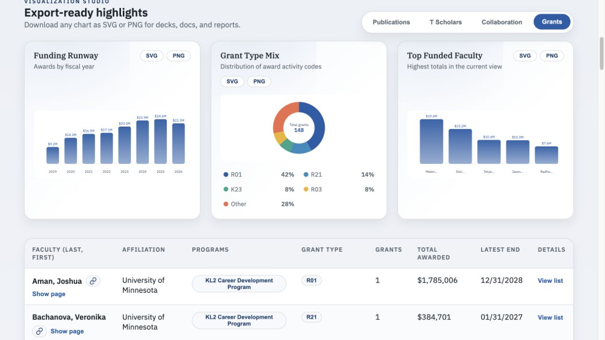
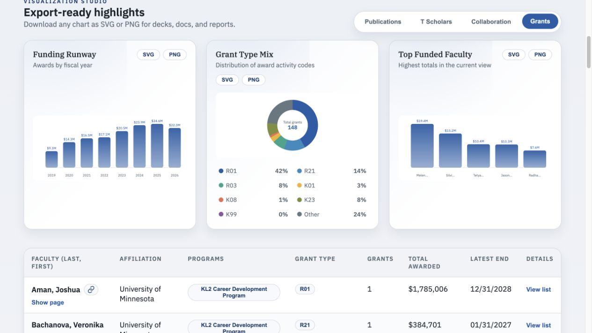
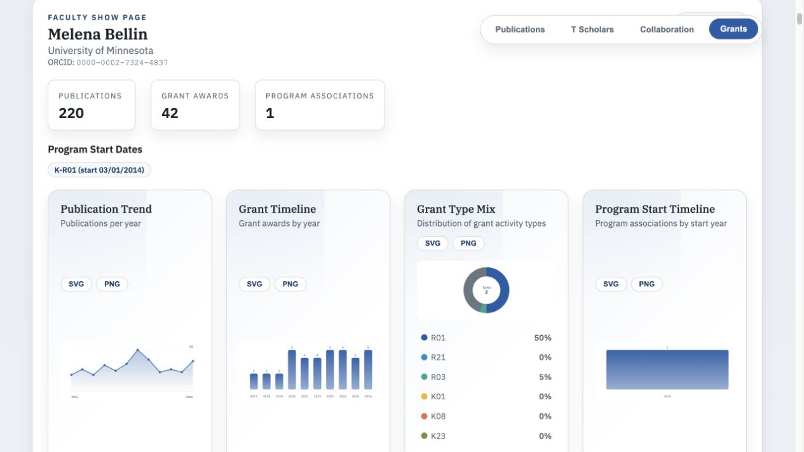

# Issue 28: fixed Grant Type Mix categories

The overview and faculty profile legends now consistently list R01, R21, R03, K01, K08, K23, K99, and Other, in that order with stable distinct colors. Zero-count categories remain in the legend but have no clickable donut arc. Unlisted types roll into Other; existing combined K99/R00 projects map to K99 without changing project grouping or funding totals.

The overview still contains 148 unique projects and $176,217,107. Exact category counts are in [counts.json](counts.json). Profile charts retain their existing annual-award counting basis; their center counts only categories with awards.

Browser verification:
- All eight categories appear in the overview, including K99 at zero.
- Clicking Other selects its underlying grant types and returns 26 faculty. As with existing table filters, their full portfolios remain visible (81 projects), with Other accounting for 35 projects. Details name Melena Bellin (3), Silvia Mangia (3), and Kathryn Cullen (2).
- Hiding every legend category displays the empty state while preserving controls; clicking R01 restores the chart.
- Melena Bellin's profile uses the same category order/colors, with three nonzero categories.

`npm run check` passes: lint, 41 tests, production build. Four new tests cover fixed order/zero counts/colors, Other and K99 mapping, real-data project conservation across the whole portfolio and individual faculty, and category-to-table-filter expansion. No source datasets changed.

## Before

## After

## Faculty profile

