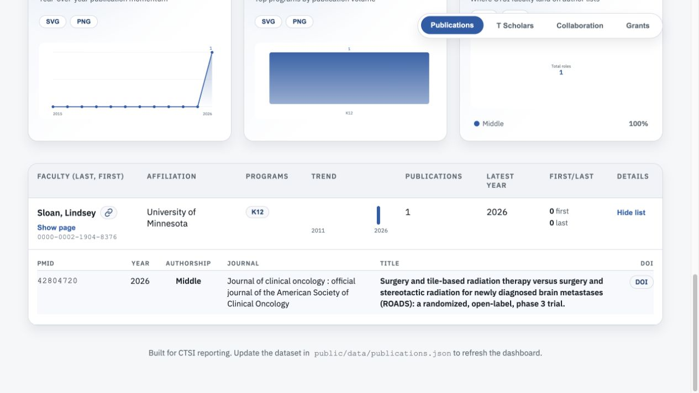
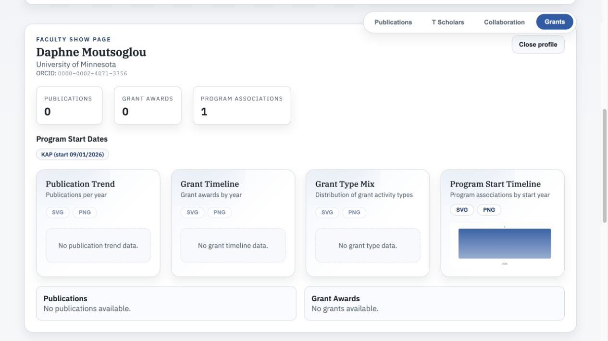

# Issue 29 verification

Added Daphne Moutsoglou, Corri Stuyvenberg, and Evan Chen to KAP, and Lindsey Sloan to K12, all starting September 1, 2026. The roster retains the exact supplied ORCIDs and signature terms. Dates use four-digit years to avoid JavaScript interpreting `26` as 1926.

Ran the production roster importer, PubMed builder, and NIH RePORTER builder against an isolated database containing these four faculty. Appended their generated records to the checked-in datasets. All 124 existing faculty records in each dataset remain byte-equivalent as parsed JSON; see [verification.json](verification.json) for counts and fetch timestamps. Existing dataset-wide refresh timestamps remain unchanged because this was a targeted refresh.

| Faculty | Program | Eligible publications | Eligible grant awards |
|---|---|---:|---:|
| Daphne Moutsoglou | KAP | 0 | 0 |
| Corri Stuyvenberg | KAP | 0 | 0 |
| Evan Chen | KAP | 0 | 0 |
| Lindsey Sloan | K12 | 1 | 0 |

These are results under the existing start-date and affiliation rules as of September 28, 2026, not lifetime totals. Lindsey's publication is [PMID 42804720](https://pubmed.ncbi.nlm.nih.gov/42804720/).

The grants table already excludes faculty with no eligible awards. All four are included in the grants JSON and have accessible faculty profiles, but do not yet contribute grant-table rows or funding totals.

Validation: `npm run check` passes: lint, 37 tests, and production build. The new integration test ingests the complete roster twice, checks unique ORCID identities, emails, signature terms and program start dates, then runs the offline exporter and verifies all four appear in both outputs. Browser verification confirms Lindsey's publication row and Daphne's profile/program membership from the Grants tab.

