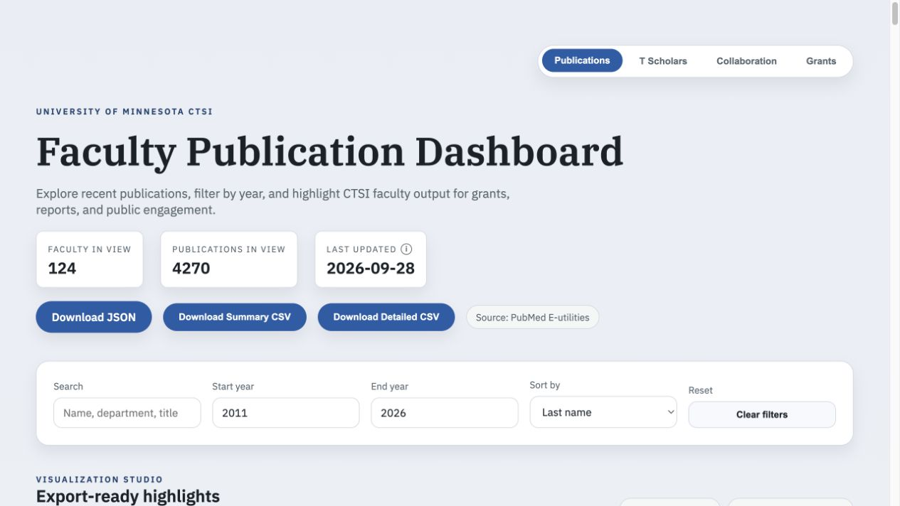

# Issue #30 verification

Verified September 28, 2026 on merged PR #34. This branch is independent of the still-open PR #35.

## Source and policy

[PubMed 37502872](https://pubmed.ncbi.nlm.nih.gov/37502872/) identifies the preprint and links to [published article 39899115](https://pubmed.ncbi.nlm.nih.gov/39899115/). The XML supplies `UpdateIn` / `UpdateOf` links and explicit publication types. Minimal source fixtures are saved under `test/fixtures/rawls-publication-versions.xml` and `rawls-articles.xml`; abstracts and unrelated fields are omitted.

Both publication refreshes prefer a journal article only when PubMed explicitly links it to a preprint and both records are eligible for that same scholar. Either link direction works, including changed titles. Ambiguous links, absent journal versions, missing publication-type metadata and standalone preprints are retained. Matching titles alone do not merge papers. The journal record retains the original preprint under `preprintVersions` in JSON for provenance, outside the counted publications array.

This change applies to both the faculty and T Scholars importers and standalone database export. Faculty version evidence is stored in SQLite; older cached records are enriched during the next faculty refresh. Export remains offline and retains records lacking version evidence until they are refreshed. Both underlying database records remain available, with selection applied separately to each researcher after curation. Charts, counts, CSV rows, keywords and coauthor summaries use the retained publications; the journal's own year, DOI and authorship remain authoritative.

## Proof

`npm run check`: lint, **36 tests**, and production build pass. Seven new tests cover the real pair, either link direction, changed titles, unrelated same-title records, missing/ambiguous evidence, standalone preprints, consistent summaries, checked-in data and two complete refreshes with local mocked PubMed responses. No live API is needed for tests.

Within the scholar dataset, only Eric Rawls changes:

- Publications: **7 → 6**.
- First-author count (including sole authorship): **4 → 3**; last-author count remains **1**.
- T Scholars overall: **324 → 323** publications; all other scholars unchanged.
- Journal PMID **39899115** appears once with year **2025**, DOI **10.1037/abn0000925**.
- Preprint PMID **37502872** is absent from the counted list and preserved as version provenance.
- Standalone NeuroFreq preprint **37961578** remains counted.

Browser verification: open T Scholars, search Eric Rawls, and expand View list. The count is six and only the journal version of the reported paper appears. The downloaded [detailed CSV](rawls-detailed.csv) has six rows, one 39899115, no 37502872, and retains 37961578.

### Before

### After

### Retained publication list

## Global faculty verification

The same rule now applies to every faculty member on the main tab. September 28 NIH XML confirms **67 redundant preprint associations across 32 faculty**. The main-tab count changes **4,337 → 4,270**; the researcher count remains **124**. All unaffected researchers retain their original data. Each retained journal record includes its preprint provenance. See [per-researcher changes](faculty-impact.json) and [PubMed version metadata](faculty-version-metadata.json). These are faculty/publication associations, not a claim of 67 distinct papers.

The full check passes **36 tests**. Integration coverage runs both importers twice, exercises faculty affiliation validation both on and off, and runs the offline exporter after each faculty refresh. A legacy-schema test backfills version metadata without deleting the two underlying records, verifies idempotence, and proves that a curated-out journal cannot suppress a retained preprint. Authorship and signal totals are calculated after version selection.

Browser verification confirms the main count of 4,270. Searching Carolyn Bramante gives **78 instead of 88** publications. Her [downloaded detailed CSV](bramante-detailed.csv) has 78 rows and none of the ten superseded preprint PMIDs. Coauthor summaries for changed faculty were recalculated from cached records when they reproduced the previous summary, supplemented with current PubMed author metadata where the cache was stale.

### Faculty before

### Faculty after

