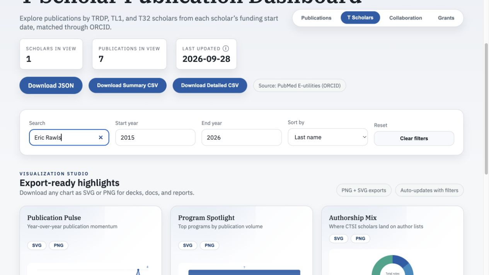
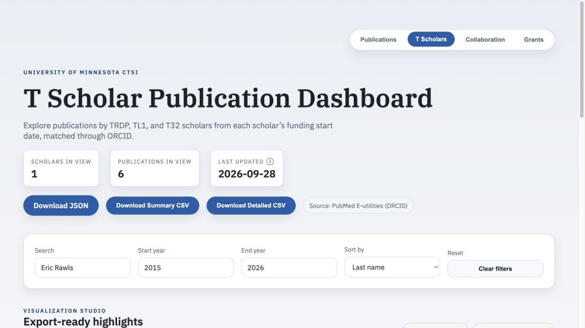

# Issue #30 verification

Verified September 28, 2026 on merged PR #34. This branch is independent of the still-open PR #35.

## Source and policy

[PubMed 37502872](https://pubmed.ncbi.nlm.nih.gov/37502872/) identifies the preprint and links to [published article 39899115](https://pubmed.ncbi.nlm.nih.gov/39899115/). The XML supplies `UpdateIn` / `UpdateOf` links and explicit publication types. Minimal source fixtures are saved under `test/fixtures/rawls-publication-versions.xml` and `rawls-articles.xml`; abstracts and unrelated fields are omitted.

The scholar refresh prefers a journal article only when PubMed explicitly links it to a preprint and both records are eligible for that same scholar. Either link direction works, including changed titles. Ambiguous links, absent journal versions, missing publication-type metadata and standalone preprints are retained. Matching titles alone do not merge papers. The journal record retains the original preprint under `preprintVersions` in JSON for provenance, outside the counted publications array.

This change applies to the T Scholars importer. It does not change faculty publication harvesting. Future refreshes use the same rule for all scholars. Charts, counts, CSV rows, keywords and coauthor summaries use the retained publications; the journal's own year, DOI and authorship remain authoritative.

## Proof

`npm run check`: lint, **35 tests**, and production build pass. Six new tests cover the real pair, either link direction, changed titles, unrelated same-title records, missing/ambiguous evidence, standalone preprints, consistent summaries, checked-in data and two complete refreshes with local mocked PubMed responses. No live API is needed for tests.

An independent before/after comparison found only Eric Rawls changed:

- Publications: **7 → 6**.
- First-author count (including sole authorship): **4 → 3**; last-author count remains **1**.
- T Scholars overall: **324 → 323** publications; all other scholars unchanged.
- Journal PMID **39899115** appears once with year **2025**, DOI **10.1037/abn0000925**.
- Preprint PMID **37502872** is absent from the counted list and preserved as version provenance.
- Standalone NeuroFreq preprint **37961578** remains counted.

Browser verification: open T Scholars, search Eric Rawls, and expand View list. The count is six and only the journal version of the reported paper appears. The downloaded [detailed CSV](rawls-detailed.csv) has six rows, one 39899115, no 37502872, and retains 37961578.

### Before

### After

### Retained publication list

