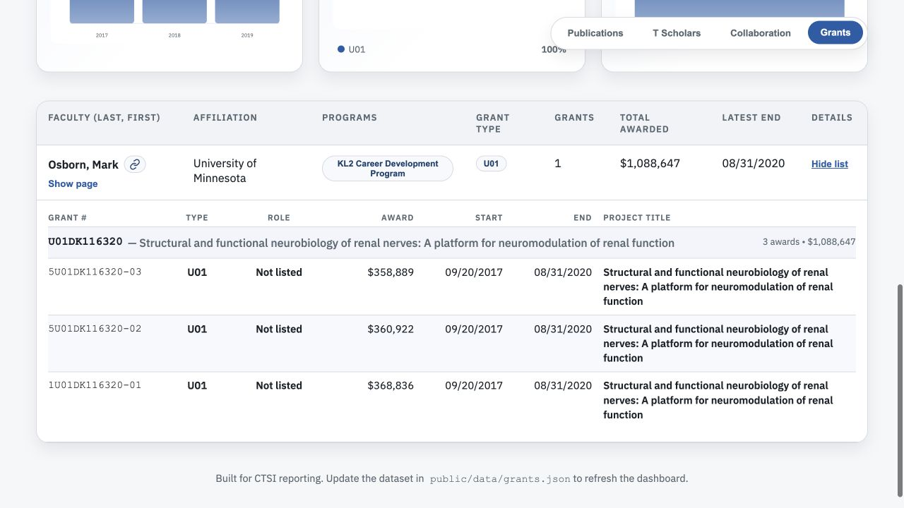
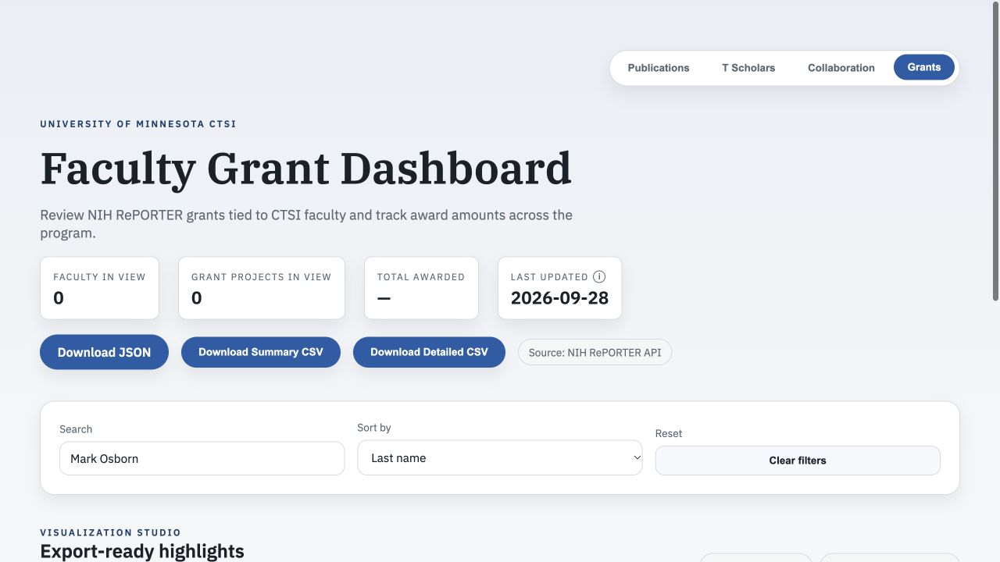

# Issue #31 verification

Verified September 28, 2026 on top of merged PR #33 (`ac59a18`).

## Source confirmation

NIH RePORTER's official project-search API lists **John W Osborn** (contact PI),
**Mark John Thomas**, and **Lyudmila H Vulchanova** for all three awards under
**U01DK116320**. Mark Osborn is not listed. The API result used by the tests is
saved in [the fixture](../../../test/fixtures/osborn-reporter.json).

- [5U01DK116320-03 (2019)](https://reporter.nih.gov/project-details/9770836): $358,889
- [5U01DK116320-02 (2018)](https://reporter.nih.gov/project-details/9567558): $360,922
- [1U01DK116320-01 (2017)](https://reporter.nih.gov/project-details/9464080): $368,836

The removed attribution totals **$1,088,647**. Only these three awards were
removed from the static data. All other faculty/grants and Mark's profile
metadata are unchanged. This is a targeted curation rule, not a general change
to NIH name matching.

## Automated proof

`npm run check` passes: lint, **22 tests**, and production build. Five new tests
cover the specific awards and future renewals/supplements, preservation of
other U01 grants and other faculty, and the corrected checked-in data.
Integration coverage executes the real build script twice against a local API
fixture, checking both SQLite and JSON each time. A separate test runs the real
export script against a temporary database containing the stale associations;
Mark's erroneous grant is absent while John's association and unrelated awards
are preserved. Tests use isolated temporary databases and no live NIH service.

## Browser verification

1. Run `npm run dev`, open **Grants**, and search **Mark Osborn**.
2. Before: one U01 project, three annual awards, total $1,088,647.
3. After: zero matching grant projects. The existing UI hides faculty with no
   grants, so Mark no longer has a row on the Grants tab.
4. Switch to **Publications** with the same search: Mark remains with all 50
   publications.

### Before

### After

