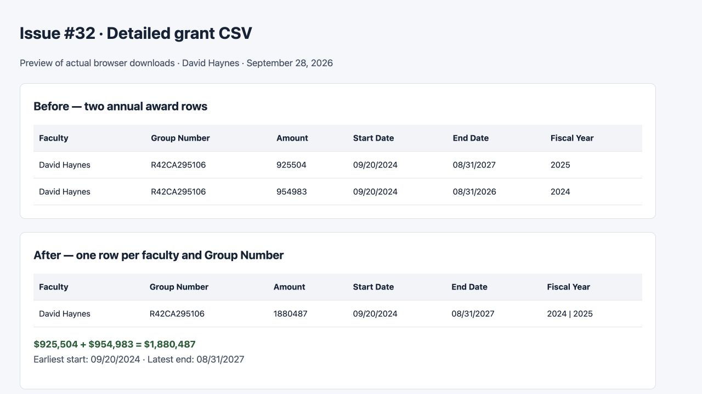
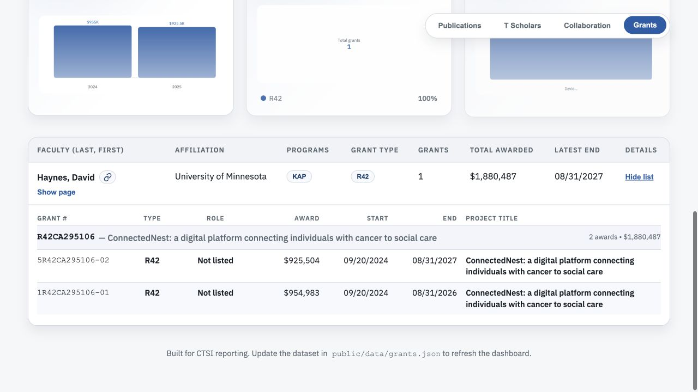

# Issue #32 verification

Verified on September 28, 2026 against the September 28 static dataset.

## Reproduce

1. Run `npm ci` and `npm run dev`.
2. Open the Grants tab and search for **David Haynes**.
3. Expand **View list**: R42CA295106 has two awards, $925,504 and $954,983.
4. Click **Download Detailed CSV**.
5. Confirm one data row for R42CA295106, Amount `1880487`, Start Date
   `09/20/2024`, End Date `08/31/2027`, and Fiscal Year `2024 | 2025`.
   Both grant IDs and both NIH RePORTER URLs are retained.

## Evidence

- [Before CSV](before.csv): downloaded from unchanged main at `1c74fdc`.
- [After CSV](after.csv): downloaded by clicking the fixed app's export button.
- The CSV screenshot below is a readable preview of selected columns from those
  actual downloads, not an additional dashboard screen.
- Independently parsed the full browser download and compared each row to
  `public/data/grants.json`: 489 annual award records became 150 unique
  faculty/group rows across 66 faculty. Every amount, earliest start, latest end,
  and set of award IDs matched. The total remained $180,019,236.
- Confirmed the search-filtered CSV contains only David Haynes and retains the
  search value in its filter column.
- `npm run check` passed: lint, all 17 tests (five new export regression tests),
  and production build.

