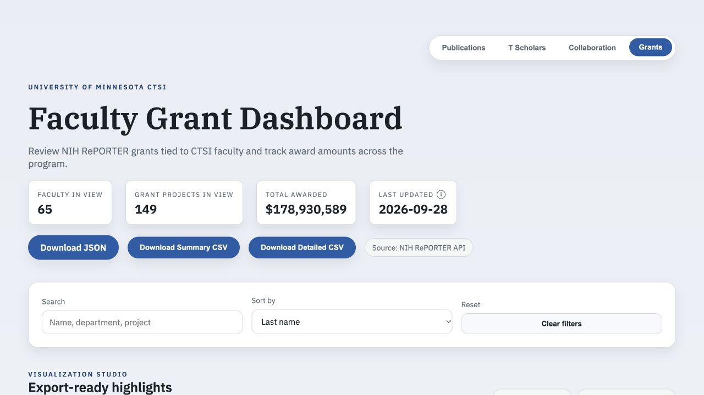
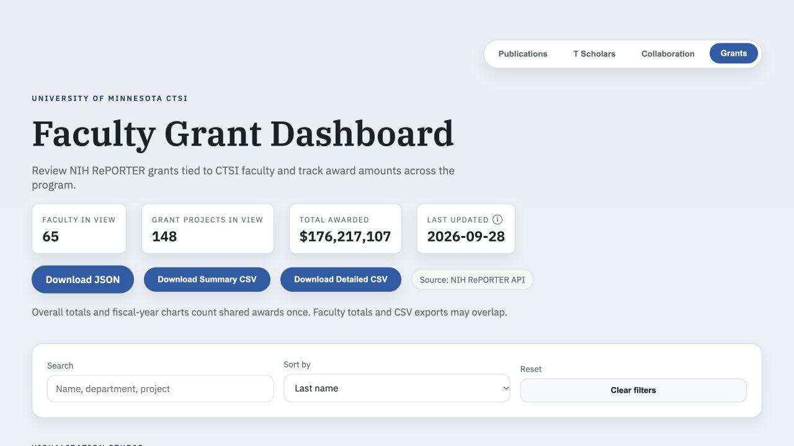
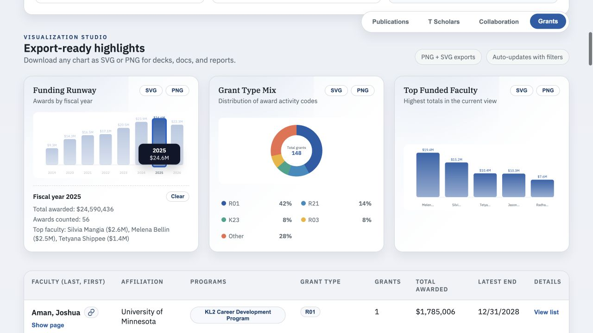
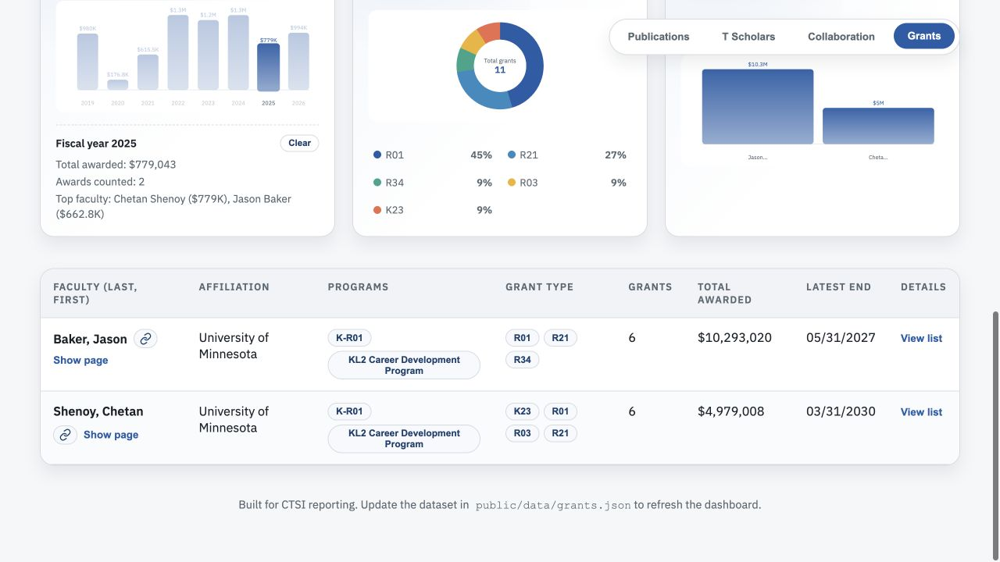

# Shared funding verification

Verified September 28, 2026, with the issue #31 attribution correction already applied in both screenshots.

Jason Baker and Chetan Shenoy both have legitimate associations with R01HL158756. Its four annual awards were previously included twice in dashboard totals:

| Fiscal year | Award | Amount counted twice |
| --- | --- | ---: |
| 2022 | 1R01HL158756-01A1 | $694,590 |
| 2023 | 5R01HL158756-02 | $685,031 |
| 2024 | 5R01HL158756-03 | $671,068 |
| 2025 | 5R01HL158756-04 | $662,793 |
| Total | | $2,713,482 |

Overall totals and fiscal-year charts now deduplicate annual awards by grant ID and fiscal year. Project totals and the grant-type chart use unique project groups. Supplements and separate annual awards remain distinct. Faculty totals and CSV exports retain both associations and can overlap; the dashboard explains this distinction.

## Automated proof

`npm run check` passes lint, all **29 tests**, and the production build. Seven new portfolio regression tests cover the four shared awards, each collaborator independently, filtering, supplements, fiscal years, K99/R00 grouping, missing/zero amounts, missing identifiers, and empty views. Input data is unchanged by aggregation.

## Browser proof

Run `npm run dev` and open Grants with no filters:

- Before: 149 projects, $178,930,589.
- After: **148 projects, $176,217,107** (exactly $2,713,482 less), still 65 faculty.
- Click fiscal year 2025: **$24,590,436 and 56 awards**, with the shared annual award counted once.
- Search R01HL158756: both faculty remain. This search selects faculty and all their projects; combined totals are 11 unique projects and $12,558,546.
- Search Jason Baker alone: 6 projects and $10,293,020. Search Chetan Shenoy alone: 6 projects and $4,979,008. Each retains their full attributed funding.

### Before

### After

### Fiscal-year detail

### Both faculty retained

